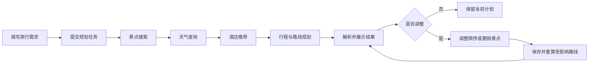

# 智能旅行助手前端设计方案

> 文档版本：1.2  
> 状态：已实现并持续迭代  
> 更新日期：2026-08-17

## 1. 设计目标

为现有四步旅行规划流程提供一个清晰、可信、可编辑的 Web 界面，使用户能够：

1. 在首页填写目的地、日期、偏好、预算和住宿类型；
2. 实时看到景点搜索、天气查询、酒店推荐、行程规划四个阶段的进度；
3. 在规划完成后查看行程概览、预算、地图、每日行程、天气和路线；
4. 进入编辑模式调整景点顺序或删除景点，并获得更新后的路线结果。

当前版本包含简单的用户名/密码注册登录和用户级历史隔离，不包含第三方登录、
多人协作、酒店和门票下单、支付、社交分享等能力。

## 2. 产品原则

- **先给结论，再给细节**：结果页顶部先展示旅行时间、预算、酒店和天气
  风险，用户向下浏览时再查看每日安排和路线。
- **进度真实可解释**：进度条与后端四步工作流对应，不虚构精确的模型完成
  百分比；同时将技术日志转换成用户可理解的“规划动态”。
- **地图与行程联动**：点击地图标记可以定位到行程项，点击行程卡片也会
  高亮对应标记。
- **编辑操作可撤销**：调整顺序和删除景点先发生在本地草稿中，用户确认
  保存后才重新计算受影响的路线。
- **未知数据不伪装成零**：后端返回的 `null` 统一显示为“待确认”，预算图表
  不把未知价格当作 0 元。
- **移动端优先可用**：核心表单、进度、结果浏览和编辑在手机上都可以完成。

## 3. 信息架构与用户流程

建议使用三个主要页面状态，并保留独立 URL，便于刷新恢复和后续分享：

```text
/                         首页 / 创建旅行
/planning/:taskId         规划进度
/plans/:planId            规划结果
/plans/:planId?mode=edit  行程编辑
```

主流程：



## 4. 页面设计

### 4.1 首页：创建旅行

#### 页面布局

桌面端采用左侧表单、右侧旅行氛围卡片的双栏布局；移动端只保留单列表单。
首屏无需地图，减少首次加载成本，也避免地图抢夺表单注意力。

```text
┌──────────────────────────────────────────────────────────────┐
│ Logo  智能旅行助手                              我的行程（后续）│
├──────────────────────────────────────────────────────────────┤
│ 让每一段旅程，都恰到好处                                     │
│ 告诉我们你的计划，AI 将结合景点、天气、酒店与路线生成行程。    │
│                                                              │
│ ┌────────────────────────────┐  ┌──────────────────────────┐ │
│ │ 目的地城市 *               │  │ 旅行灵感卡 / 产品说明    │ │
│ │ 旅行日期 *                 │  │ · 实时天气               │ │
│ │ 旅行偏好 *                 │  │ · 景点与酒店             │ │
│ │ 总预算 *                   │  │ · 多交通方式路线         │ │
│ │ 住宿类型 *                 │  │                          │ │
│ │ 补充要求（可选）           │  │                          │ │
│ │ [       开始规划       ]   │  └──────────────────────────┘ │
│ └────────────────────────────┘                               │
└──────────────────────────────────────────────────────────────┘
```

#### 表单字段

| 字段 | 控件 | 校验与交互 |
|---|---|---|
| 目的地城市 | 可搜索城市输入框 | 必填；只允许选择一个明确城市；输入时显示城市候选，提交值同时保留城市名与 `adcode`（若可获取） |
| 旅行日期 | 日期范围选择器 | 必填；结束日期不能早于开始日期；MVP 建议限制为 1–7 天，并在产品文案中明确 |
| 旅行偏好 | 多选标签 + 自定义输入 | 必填；预设“历史文化、自然风光、美食探索、亲子、艺术、人文街区、休闲度假”；建议最多 5 项 |
| 总预算 | 带人民币前缀的数字输入框 | 必填；大于 0；明确表示“本次旅行总预算”，避免与人均预算混淆 |
| 住宿类型 | 单选卡片 | 必填；经济型、舒适型、豪华型、不限 |
| 补充要求 | 多行文本 | 可选；例如“只安排故宫和国家博物馆”“不早于 9 点出发”；建议限制 500 字 |

表单底部固定显示主按钮“开始规划”。提交前在前端完成即时校验；提交过程中
禁用按钮并显示“正在创建任务…”，防止重复创建。

建议提交结构：

```json
{
  "destination_city": "北京",
  "destination_adcode": "110000",
  "start_date": "2026-08-01",
  "end_date": "2026-08-03",
  "preferences": ["历史文化", "美食探索"],
  "budget_cny": 5000,
  "accommodation_type": "经济型",
  "additional_requirements": "每天不早于 9 点出发"
}
```

### 4.2 规划进度页

规划任务创建成功后立即进入该页。页面需要让用户感到系统正在推进，同时
避免暴露模型思维链、系统提示词、API Key 或完整工具响应。

```text
┌───────────────────────────────────────────────────────────┐
│ 正在规划你的北京之旅                                      │
│ 预计需要 1–3 分钟，请保持页面开启                         │
│                                                           │
│ [██████████████░░░░░░░░░░]  2/4 天气查询已完成            │
│                                                           │
│  ✓ 1. 搜索符合偏好的景点                                  │
│  ✓ 2. 查询旅行期间天气                                    │
│  ● 3. 推荐合适的酒店                                      │
│  ○ 4. 生成每日行程与路线                                  │
│                                                           │
│ 规划动态                                      [收起日志]   │
│ 10:21 已找到北京历史文化类景点                            │
│ 10:22 已获得未来三天天气预报                              │
│ 10:22 正在筛选经济型酒店…                                 │
└───────────────────────────────────────────────────────────┘
```

#### 进度规则

进度严格映射后端固定流程：

| 阶段 | 页面名称 | 完成进度 |
|---|---|---:|
| attraction | 搜索符合偏好的景点 | 25% |
| weather | 查询旅行期间天气 | 50% |
| hotel | 推荐合适的酒店 | 75% |
| planner | 生成每日行程与路线 | 100% |

当前阶段未结束时，使用对应区间内的动画效果，而不是持续增加一个无法保证的
百分比。路线规划耗时通常最长，应显示“正在比较步行、驾车和公共交通路线”，
降低用户误以为页面卡死的概率。

#### 日志展示

页面展示的是结构化事件生成的用户日志，不直接把 Python 控制台日志原样输出。

推荐事件示例：

```json
{
  "event_id": "evt_123",
  "type": "tool.retrying",
  "timestamp": "2026-07-31T10:22:15+08:00",
  "stage": "weather",
  "tool": "maps_weather",
  "attempt": 2,
  "max_attempts": 2,
  "error_code": "TOOL_TIMEOUT",
  "retryable": true,
  "message": "maps_weather 暂时失败，正在进行第 2/2 次尝试"
}
```

日志分两层：

- 默认显示“规划动态”：只包含阶段开始、阶段完成、路线计算和可恢复错误；
- 开发环境可展开“技术详情”：显示 Agent 轮次、工具名称、耗时和截断后的
  返回摘要，但仍不得显示密钥、系统提示词或完整模型上下文。

如果用户刷新页面，前端根据 `taskId` 查询任务状态并从最后一个
`event_id` 继续接收事件，不应重新创建规划任务。

### 4.3 规划结果页

#### 页面结构

桌面端使用“内容 7/12 + 地图 5/12”的布局，地图在浏览每日行程时保持吸顶。
移动端将地图放入可展开区域，并提供“列表 / 地图”切换。

```text
┌──────────────────────────────────────────────────────────────┐
│ 北京 · 3日历史文化之旅          [编辑行程] [重新规划]         │
│ 8月1日—8月3日 · 预算 ¥5,000 · 经济型酒店                     │
├──────────────────────────────────────────────────────────────┤
│ [概览] [每日行程] [预算] [天气与提示]                         │
├───────────────────────────────┬──────────────────────────────┤
│ 行程概览                      │ 景点地图                     │
│ 酒店卡片                      │  ① 故宫  ── ② 国博          │
│ 天气摘要                      │  [第1天] [第2天] [全部]      │
│                               │                              │
│ 第 1 天  历史文化             │                              │
│ 09:00  故宫博物院             │                              │
│   ↓ 公交 15 分钟 / 1.8 km     │                              │
│ 13:30  中国国家博物馆         │                              │
│                               │                              │
│ 第 2 天 …                     │                              │
├───────────────────────────────┴──────────────────────────────┤
│ 预算明细 · 预订与安全提示 · 数据说明                          │
└──────────────────────────────────────────────────────────────┘
```

#### A. 顶部概览

展示：

- 目的地、开始和结束日期、天数；
- 用户偏好与住宿类型；
- 总预算和当前可确认的预计支出；
- 已选酒店；
- 最重要的一条天气或安全提醒；
- 后端的 `unresolved_fields`，以“仍需确认”提示展示。

“预计总支出”为 `null` 时显示“部分价格待确认”，不能显示 `¥0`。

#### B. 每日行程

使用日期标签页切换不同天。每天由一条垂直时间轴组成：

- 日期、主题、当天天气和出行建议；
- 景点序号、时间段、名称、地址、活动、停留时长和备注；
- 相邻地点之间插入路线卡片；
- 路线卡片同时展示步行、驾车和公共交通的距离、时间；
- 推荐方式突出显示，不可用方式显示原因，不自行估算。

点击景点卡片时：

1. 地图定位并高亮相应标记；
2. 打开包含景点名称、地址、到达时间的地图信息窗；
3. 移动端自动展开地图半屏面板，但保留返回列表入口。

#### C. 天气

按旅行日期展示天气卡片，包含：

- 白天和夜间天气；
- 最低、最高温度；
- 雨具、防晒、防暑等建议；
- 恶劣天气使用醒目但不过度惊吓的警示色。

若规划日期超出高德天气可用预报范围，显示“该日期天气暂不可用”，不要把
最近日期天气复制到未来日期。

#### D. 预算明细

预算区域展示总预算、已知预计支出、剩余金额以及交通、门票、餐饮、酒店四类：

```text
总预算 ¥5,000
已确认估算 ¥2,100
待确认：酒店实时价格、部分门票

交通  ¥180     门票  ¥300
餐饮  ¥620     酒店  ¥1,000
```

图表只对非 `null` 数据绘制；未知项独立列在“待确认费用”，不进入占比计算。
若 `estimated_total` 大于总预算，以警告状态显示，并提供“编辑行程”入口。

#### E. 景点地图

地图使用高德地图 JS API 2.0：

- 酒店使用独立的 `H` 标记；
- 景点按每天的访问顺序使用 `1、2、3…` 编号；
- 不同日期使用不同颜色，当前日期的标记和路线提高视觉层级；
- 点击标记打开 `InfoWindow`；
- 通过 `Polyline` 展示访问顺序，路线详情仍以服务端返回数据为准；
- 提供“全部行程 / 第 N 天”筛选与“适应视野”按钮；
- 地图加载失败时保留完整列表和路线卡片，不阻断结果页。

MVP 的地图目标是准确展示地点与访问顺序。若要展示贴合道路的真实路线几何，
后端需返回路线轨迹，或由前端使用高德路线插件再次查询。为避免前后端路线
结果不一致，优先由后端统一返回路线坐标和轨迹。

### 4.4 编辑行程

点击“编辑行程”后，结果页进入草稿模式，不跳转到完全不同的页面。

#### 可编辑范围

MVP 支持：

1. 在同一天内拖拽调整景点顺序；
2. 删除某个景点；
3. 撤销最近操作；
4. 放弃修改并恢复原计划；
5. 保存修改并重新计算受影响路线。

暂不支持直接拖动地图路线来改变景点顺序。高德 `AMap.DragRoute` 主要用于
编辑驾车路线途经点且仅支持桌面浏览器，不适合作为手机端的核心编辑交互。

```text
┌──────────────────────────────────────────────────────────────┐
│ 编辑第 1 天                               [取消] [保存调整]   │
│                                                              │
│ ⠿ 1  故宫博物院                              [定位] [删除]   │
│ ⠿ 2  中国国家博物馆                          [定位] [删除]   │
│                                                              │
│ 顺序已修改，保存后将重新计算 3 段路线。                       │
└──────────────────────────────────────────────────────────────┘
```

#### 编辑规则

- 拖拽过程中地图编号即时更新，但原路线显示为虚线并标注“待重新计算”；
- 删除后使用底部消息条提供 8 秒“撤销”，降低误操作成本；
- 保存时只重新计算受影响的相邻边：
  - 调整顺序：重新计算顺序发生变化的路线；
  - 删除景点：删除旧的前后两段，并计算“前一地点 → 后一地点”；
- 路线更新成功后生成新的计划修订版本；
- 路线更新失败时保留用户修改后的景点顺序，将路线标为“暂不可用”，允许重试；
- 保存期间锁定再次拖拽，避免并发覆盖；
- 移动端除拖拽外，必须提供“上移 / 下移”按钮，兼顾触摸精度与无障碍操作。

## 5. 视觉与交互规范

### 5.1 视觉方向

整体采用“自然、可信、轻探索”的旅行工具风格，避免过度卡通化：

- 主色：深青绿色，用于主按钮、当前步骤和推荐路线；
- 辅色：天空蓝，用于地图、天气和信息状态；
- 强调色：暖橙色，用于预算提醒、景点序号和关键提示；
- 背景：浅灰白，内容卡片使用白色和轻阴影；
- 圆角：卡片 12–16px，输入框和按钮 10–12px；
- 字体：优先系统中文无衬线字体，数字使用等宽数字特性以提高预算可读性。

所有状态不能只依赖颜色区分，需要同时配合图标和文字。

### 5.2 响应式

| 断点 | 布局 |
|---|---|
| ≥ 1200px | 结果页内容与吸顶地图双栏；最大内容宽度约 1280px |
| 768–1199px | 表单保持单栏居中；结果地图位于概览下方 |
| < 768px | 单栏；底部固定主操作；结果页提供列表/地图切换；日志默认折叠 |

### 5.3 无障碍

- 表单字段有可见标签、错误说明和键盘焦点；
- 规划阶段变化通过 `aria-live="polite"` 播报，但不逐条播报高频日志；
- 拖拽列表支持键盘排序；
- 地图不是获取行程信息的唯一方式；
- 尊重系统“减少动态效果”设置；
- 正文和交互控件满足 WCAG AA 对比度目标。

## 6. 前端技术方案

### 6.1 技术栈选型

前端确定采用 Vue 3 技术栈：

| 能力 | 选型 | 使用范围 |
|---|---|---|
| 核心框架 | Vue 3 + TypeScript | 使用 Composition API 和 `<script setup lang="ts">` 编写页面与组件 |
| 构建工具 | Vite | 本地开发、资源构建、环境变量和代码分包 |
| UI 组件库 | Ant Design Vue | 表单、日期范围、步骤条、进度条、时间线、卡片、标签页、抽屉和反馈状态 |
| 路由 | Vue Router | 首页、规划进度页、结果页和编辑模式 |
| 状态管理 | Pinia | 当前任务、编辑草稿、地图联动和跨页面恢复状态 |
| 普通 HTTP | Axios | 创建任务、查询状态、获取结果和保存编辑 |
| 实时进度 | 原生 `EventSource` / SSE | 接收 LangGraph 节点状态和经过脱敏的 Harness 事件 |
| 地图 | 高德地图 JS API 2.0 + 官方 Loader | 地图、景点标记、信息窗、顺序连线和视野调整 |
| 拖拽排序 | 支持 Vue 3 和键盘操作的拖拽组件 | 同日景点排序；具体依赖在实现阶段锁定版本 |
| 类型检查 | `vue-tsc` | 在本地和 CI 中执行完整 TypeScript 检查 |
| 测试 | Vitest + Vue Test Utils + Playwright | 单元、组件、集成和浏览器端到端测试 |

选择该方案的原因：

- 项目以复杂表单、进度步骤、时间线、结果卡片和编辑操作为主，
  Ant Design Vue 可以较快覆盖基础交互；
- Vue Composition API 适合将任务事件流、地图实例、行程编辑等状态逻辑
  拆分成独立 composable；
- 当前后端通过 HTTP 和 SSE 与浏览器通信，不依赖特定前端框架；
- Vue 3 + Vite 可以作为独立单页应用部署，不需要为了当前功能引入 SSR；
- 默认 Ant Design Vue 视觉偏企业应用，因此只复用交互和基础组件，通过
  Theme Token、业务卡片和地图标记实现旅行产品视觉。

### 6.2 各技术职责

#### Vue 3 与 TypeScript

- 统一使用 Composition API 和 `<script setup lang="ts">`；
- 页面只负责编排，任务事件、地图、预算和编辑逻辑抽成 composable；
- API 请求、SSE 事件和 Planner 结果都定义 TypeScript 类型；
- 后端 JSON 在进入业务状态前进行运行时结构校验，避免只依赖编译期类型。

#### Ant Design Vue

建议组件映射：

| 页面能力 | 组件方向 |
|---|---|
| 首页表单 | Form、AutoComplete、DatePicker、Select、InputNumber、Radio、Input、Button |
| 规划进度 | Steps、Progress、Timeline、Collapse、Alert |
| 结果概览 | Card、Statistic、Tag、Tabs、Badge |
| 每日行程 | Timeline、List、自定义路线卡片 |
| 编辑模式 | List、自定义拖拽手柄、Popconfirm、Message |
| 异常与空状态 | Result、Empty、Skeleton、Spin |
| 移动端地图 | Drawer 或自定义底部面板 |

主按钮、天气卡、预算条、景点序号、地图标记和路线卡片采用自定义业务样式，
避免整站呈现为通用后台管理系统。

#### Axios 与 SSE

Axios 只处理普通请求：

- `POST /api/travel-plans` 创建任务；
- `GET /api/travel-plans/:taskId` 恢复状态；
- `GET /api/plans/:planId` 获取结果；
- `GET /api/sessions/:sessionId` 获取多轮版本链；
- `PATCH /api/plans/:planId/itinerary` 保存编辑。

创建单独的 Axios 实例，统一配置 `baseURL`、超时、请求 ID、错误转换和认证。
拦截器不得记录表单中的敏感自由文本或任何服务端 Key。

规划日志是服务端到浏览器的单向事件流，应使用原生 `EventSource`，不通过
Axios 轮询。SSE 客户端负责：

- 监听阶段、工具和任务完成事件；
- 使用事件 ID 去重；
- 断线后自动重连；
- 页面销毁或任务结束时主动 `close()`；
- 重连后通过任务状态接口补齐可能遗漏的结果。

若未来认证必须依赖自定义 `Authorization` 请求头，而不能使用同站 Cookie，
则改用基于 Fetch 流的 SSE 客户端；MVP 优先让 SSE 与页面同源。

#### Pinia 状态边界

Pinia 只保存需要跨组件或跨页面共享的状态：

- `planningStore`：`taskId`、当前阶段、日志摘要、连接状态；
- `planStore`：当前计划、修订号、当前选中日期；
- `itineraryEditorStore`：原计划快照、编辑草稿、撤销栈、待重算路线；
- `mapStore`：选中地点、地图筛选日期和地图加载状态。

表单字段、弹窗开关等页面局部状态保留在组件或 composable 中，避免所有状态
都进入全局 Store。最终计划以服务端响应为事实来源，Pinia 不长期缓存另一份
无法同步的副本。

#### Vite 与类型检查

Vite 负责快速开发和 TypeScript 转译，但不负责完整类型检查。建议至少提供：

```text
npm run dev
npm run build
npm run type-check    # vue-tsc --noEmit
npm run test
npm run test:e2e
```

CI 必须先通过 `vue-tsc --noEmit` 和测试，再执行生产构建。高德 Web 端 Key
通过 Vite 环境变量注入；高德服务端 Web 服务 Key 永远不进入前端环境变量。

### 6.3 目录结构

建议按业务模块组织：

```text
src/
├── app/                 # 应用入口、Vue Router、Pinia、主题
│   ├── router/
│   └── styles/
├── pages/
│   ├── trip-create/
│   ├── trip-planning/
│   └── trip-result/
├── features/
│   ├── planning-events/
│   ├── itinerary-editor/
│   ├── trip-map/
│   ├── weather/
│   └── budget/
├── entities/
│   ├── trip/
│   ├── itinerary/
│   └── route/
├── stores/              # Pinia 跨页面状态
├── services/
│   ├── http/            # Axios 实例和 API 模块
│   ├── events/          # EventSource/SSE 适配器
│   └── amap/            # 高德 JS API 加载与地图适配器
├── composables/         # 可复用的 Vue 组合式逻辑
└── shared/              # UI 组件、类型、校验和工具函数
```

地图能力应封装为独立适配器，业务组件不直接到处调用 `AMap.*`，便于测试、
错误降级和未来更换实现。`.vue` 组件中只消费地点、标记和路线等领域对象，
不直接保存不可序列化的高德地图实例到持久化 Store。

## 7. 前后端接口设计

### 7.1 当前后端与前端需求的差距

| 能力 | 当前状态 | 前端接入前建议 |
|---|---|---|
| 旅行规划执行 | 同步 CLI 调用 | 增加异步 HTTP 任务接口 |
| 过程日志 | Python 文本日志 | 转换为可订阅的结构化事件 |
| 最终结果 | Planner 返回 JSON 字符串 | 服务端校验后返回 JSON 对象 |
| 任务恢复 | 无 | 持久化任务状态，支持按 `taskId` 查询 |
| 地图坐标 | 最终计划只有名称和地址 | 给酒店和行程项增加经纬度 |
| 行程项标识 | 无稳定 ID | 增加 `schedule_item_id` |
| 编辑并发 | 无修订号 | 增加 `revision` 乐观锁 |
| 路线图形 | 只有距离和时间 | 可选增加 `path` 坐标数组 |

现有 Planner JSON 不需要推翻。建议 API 在外层增加任务元数据，内部 `plan`
继续使用当前结构：

```json
{
  "plan_id": "plan_123",
  "task_id": "task_123",
  "revision": 1,
  "status": "completed",
  "generated_at": "2026-07-31T10:25:00+08:00",
  "plan": {
    "plan_version": "1.0",
    "request_summary": {},
    "weather_summary": [],
    "selected_hotel": {},
    "daily_itinerary": [],
    "budget_summary": {},
    "booking_and_safety_tips": [],
    "data_notes": []
  }
}
```

### 7.2 建议接口

#### 创建任务

```http
POST /api/travel-plans
Idempotency-Key: <客户端生成的 UUID>
```

返回：

```json
{
  "task_id": "task_123",
  "session_id": "session_123",
  "status": "queued",
  "events_url": "/api/travel-plans/task_123/events"
}
```

追问仍使用同一创建任务接口，并在旅行请求中增加：

```json
{
  "session_id": "session_123",
  "previous_plan_id": "plan_123",
  "additional_requirements": "换个酒店，其他安排不变"
}
```

后端加载上一版计划和研究上下文，由 LangGraph 变更分析节点决定哪些研究
节点重跑；未变化节点通过 `node.skipped` 事件说明复用原因。

#### 获取任务状态

```http
GET /api/travel-plans/:taskId
```

用于首次进入、刷新恢复和 SSE 断线后的状态同步。

#### 订阅规划事件

```http
GET /api/travel-plans/:taskId/events
Accept: text/event-stream
```

此场景主要是服务端向浏览器单向推送，优先选择 SSE；只有未来需要实时多人
协作时再考虑 WebSocket。前端通过原生 `EventSource` 订阅此接口，Axios
不参与事件流读取。

推荐事件类型：

```text
task.queued
task.started
change.analysis
node.skipped
node.degraded
stage.started
agent.iteration
agent.recovering
tool.started
tool.retrying
tool.completed
tool.failed
stage.completed
plan.completed
task.failed
```

`plan.completed` 只返回 `plan_id`，前端再通过结果接口获取完整数据，避免把
大 JSON 混入日志流。失败任务和失败事件携带 `error_code`、`retryable` 和
`error_id`；技术异常原文只进入服务端日志，不通过 SSE 暴露。前端默认等待时间
应长于后端任务总超时，并在可重试失败后保留原请求供用户显式重试。

#### 获取结果

```http
GET /api/plans/:planId
```

#### 获取会话版本链

```http
GET /api/sessions/:sessionId
```

#### 保存编辑结果

```http
PATCH /api/plans/:planId/itinerary
```

请求：

```json
{
  "base_revision": 1,
  "operations": [
    {
      "type": "reorder",
      "day": 1,
      "schedule_item_ids": ["item_2", "item_1"]
    },
    {
      "type": "remove",
      "day": 1,
      "schedule_item_id": "item_3"
    }
  ]
}
```

服务端校验修订号、重新计算受影响路线并返回新的完整计划。若修订号冲突，
返回 `409 Conflict`，前端提示用户刷新计划后重新编辑。

### 7.3 结果字段补充建议

为地图和编辑功能补充以下由服务端生成的确定性字段，不要求 LLM 自行编造：

```json
{
  "schedule_item_id": "item_123",
  "place_name": "故宫博物院",
  "address": "北京市东城区景山前街4号",
  "location": {
    "longitude": 116.397005,
    "latitude": 39.919278
  }
}
```

路线可选增加：

```json
{
  "route_id": "route_123",
  "path": [
    [116.397005, 39.919278],
    [116.397755, 39.903182]
  ],
  "path_source": "amap"
}
```

经纬度和轨迹应该来自高德服务结果或后端地理编码缓存，不应让模型生成。

## 8. 高德地图接入方案

### 8.1 推荐能力

- 使用高德地图 JS API 2.0 和官方 Loader 在线加载；
- 使用 `AMap.Map` 创建地图；
- 使用 `AMap.Marker` 或 `LabelMarker` 展示酒店和景点；
- 使用 `AMap.InfoWindow` 展示地点摘要；
- 使用 `AMap.Polyline` 展示访问顺序或后端返回的路线轨迹；
- 必要时使用 `AMap.Geocoder` 作为地址坐标缺失时的降级方案；
- 真实驾车、公交和步行路线以当前后端高德 MCP 查询结果为主。

### 8.2 Key 与安全要求

高德 Web 服务 Key 与 Web 端（JS API）Key 是不同平台类型：

- 当前后端 Key 继续只在服务端/MCP 子进程中使用，绝不能注入浏览器；
- 前端另行申请“Web 端（JS API）”Key；
- 生产环境采用高德推荐的安全密钥代理方式，并配置域名白名单；
- 安全密钥、服务端 Key、请求签名等敏感信息不得写入前端仓库；
- 地图加载脚本遵循官方要求在线加载，不本地转存或混入应用产物。

### 8.3 降级策略

- JS API 加载失败：显示静态占位和“地图暂不可用”，保留列表全部信息；
- 某地点坐标解析失败：该地点仍在行程列表显示，地图卡片标注“无法定位”；
- 某种交通路线失败：只禁用该方式，不影响其他交通方式和整份计划；
- 地图额度或网络错误：记录可观测错误码，但不向用户展示 Key 或原始接口响应。

## 9. 页面状态与异常处理

统一状态机：

```text
draft → submitting → planning → completed
                    ↘ failed
completed → editing → saving → completed
                         ↘ save_failed
```

关键异常：

| 场景 | 页面处理 |
|---|---|
| 表单不完整 | 字段下方提示具体原因，并聚焦第一个错误 |
| 创建任务超时 | 保留用户填写内容，允许原请求重试 |
| SSE 断线 | 自动退避重连，并用状态接口补齐结果 |
| 某个专家失败 | 显示失败阶段、可读原因和“重试本次规划” |
| 达到 Agent 最大轮次 | 显示“规划未完成”，允许保持原输入重新发起 |
| 最终 JSON 校验失败 | 不进入结果页，服务端记录原始输出并返回统一错误 |
| 地图失败 | 降级到行程列表，不阻断查看和编辑 |
| 编辑保存冲突 | 提示计划已更新，刷新后重新编辑 |

失败页面必须保留“返回修改需求”和“使用原需求重试”两个入口。

## 10. 性能、隐私与可观测性

### 性能

- 首页不加载地图 SDK，进入结果页后再懒加载；
- 长日志列表采用数量上限或虚拟滚动；
- 结果页按天渲染路线，默认只突出当前天；
- 避免前端重复地理编码，优先消费后端坐标；
- SSE 重连使用 `Last-Event-ID`，防止重复日志。

### 隐私与安全

- 不在浏览器日志或用户日志中显示 LLM Key、高德服务端 Key、系统提示词；
- 对补充要求等自由文本进行输出转义；
- 服务端日志预览继续限制长度；
- 规划任务和结果接口使用不可预测 ID；
- 若后续支持账号，需要校验计划归属，不能只凭 `planId` 访问。

### 可观测指标

建议记录：

- 表单提交成功率；
- 各阶段耗时与失败率；
- 整体规划完成率；
- SSE 重连率；
- 地图加载失败率；
- 编辑进入率、保存成功率和撤销率；
- 从提交到首次看到有效结果的耗时。

## 11. 测试与验收标准

### 核心验收

1. 用户能填写全部必填项并创建规划任务；
2. 页面能显示三路并行研究、状态汇合、行程合成节点和经过脱敏的日志；
3. 刷新进度页后能恢复同一任务；
4. 结果页能解析现有 Planner 全部顶层字段；
5. `null` 预算显示为“待确认”，不会显示为 0；
6. 地图能展示酒店、景点顺序，并与行程列表双向联动；
7. 地图不可用时仍能完整查看行程；
8. 用户能调整同日景点顺序、删除景点、撤销和保存；
9. 保存后只更新受影响路线，所有地图序号与路线卡片保持一致；
10. 手机端可完成创建、查看和编辑全流程。

### 建议测试层级

- 单元测试：表单校验、预算格式化、Planner JSON 适配、编辑操作归并；
- 组件测试：进度步骤、日志面板、天气卡、路线卡、预算未知状态；
- 集成测试：模拟 SSE 正常完成、断线重连、任务失败；
- 地图适配器测试：标记、筛选、定位、加载失败降级；
- E2E：创建任务 → 查看进度 → 打开结果 → 调整顺序 → 删除 → 保存；
- 视觉回归：桌面、平板、手机三种尺寸。

## 12. 实施阶段

### Phase 1：可用闭环

- 首页表单；
- 异步任务与四步进度；
- 用户可读日志；
- 结果页概览、每日行程、天气、预算；
- 高德地图景点标记和访问顺序；
- 同日排序、删除、撤销与路线重算；
- 完整异常和移动端适配。

### Phase 2：体验增强

- 跨天移动景点；
- 替换景点和酒店；
- 地图道路级路线轨迹；
- 计划历史版本对比；
- 行程收藏、分享和导出；
- 超预算时提供可解释的优化建议。

## 13. 实施前需确认的产品决策

1. MVP 允许规划的最大天数；
2. 预算是整单预算，还是需要增加出行人数和人均预算；
3. 规划结果是否需要持久化，以及匿名计划保留时长；
4. 编辑后只重算路线，还是允许 Planner 再次调整时间段和预算；
5. 是否允许跨天拖拽景点；
6. 登录后才能查看本人历史行程（已确认并实现）；
7. 前端地图是否需要展示道路级轨迹，还是景点顺序连线即可满足 MVP。

## 14. 技术参考

### 前端框架与通信

- [Vue 3 TypeScript 指南](https://vuejs.org/guide/typescript/overview)
- [Vue Composition API 与 TypeScript](https://vuejs.org/guide/typescript/composition-api)
- [Vite TypeScript 能力与类型检查说明](https://vite.dev/guide/features.html#typescript)
- [Ant Design Vue 组件总览](https://www.antdv.com/components/overview)
- [Vue Router](https://router.vuejs.org/)
- [Pinia](https://pinia.vuejs.org/introduction.html)
- [Axios 文档](https://axios-http.com/docs/intro)
- [WHATWG Server-Sent Events](https://html.spec.whatwg.org/dev/server-sent-events.html)

### 高德地图

- [高德地图 JS API 2.0 概述](https://lbs.amap.com/api/javascript-api-v2/summary/)
- [JS API 2.0 加载方式](https://lbs.amap.com/api/javascript-api-v2/guide/abc/load)
- [JS API 安全密钥使用](https://lbs.amap.com/api/javascript-api-v2/guide/abc/jscode)
- [JS API 2.0 快速上手：Marker、InfoWindow、Polyline](https://lbs.amap.com/api/javascript-api-v2/getting-started)
- [JS API 2.0 路线规划](https://lbs.amap.com/api/javascript-api-v2/guide/services/navigation)
- [Web 服务地理编码](https://lbs.amap.com/api/webservice/guide/api/georegeo)
